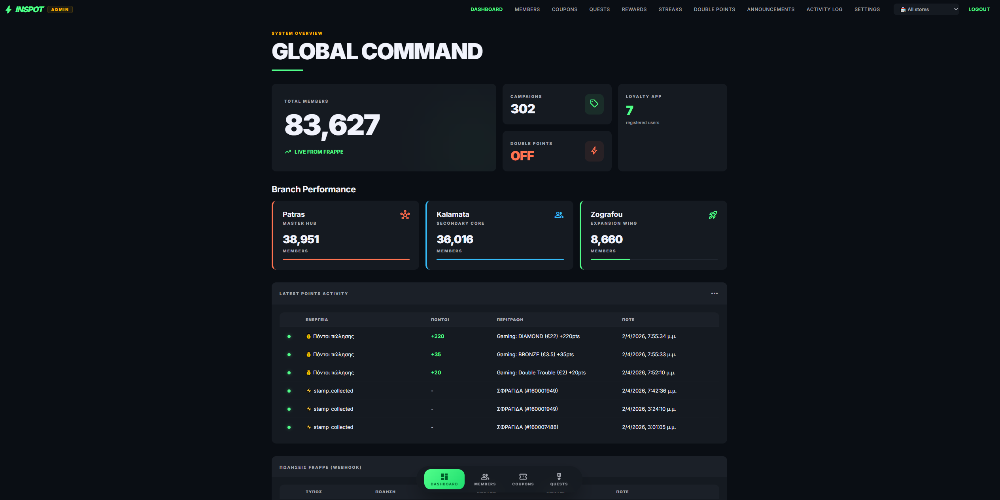
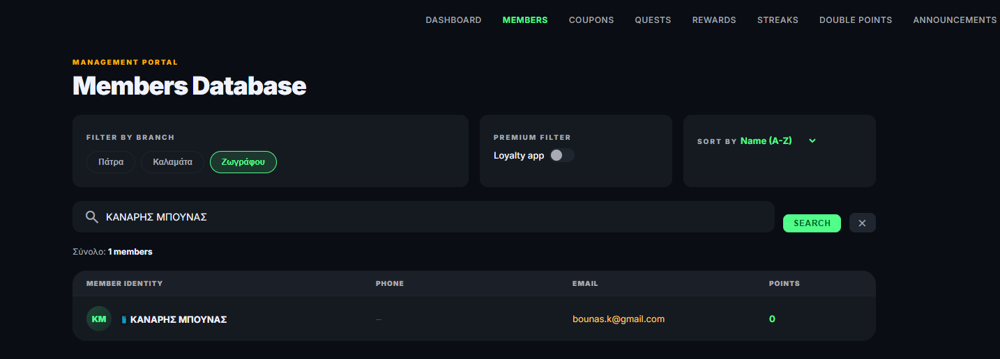
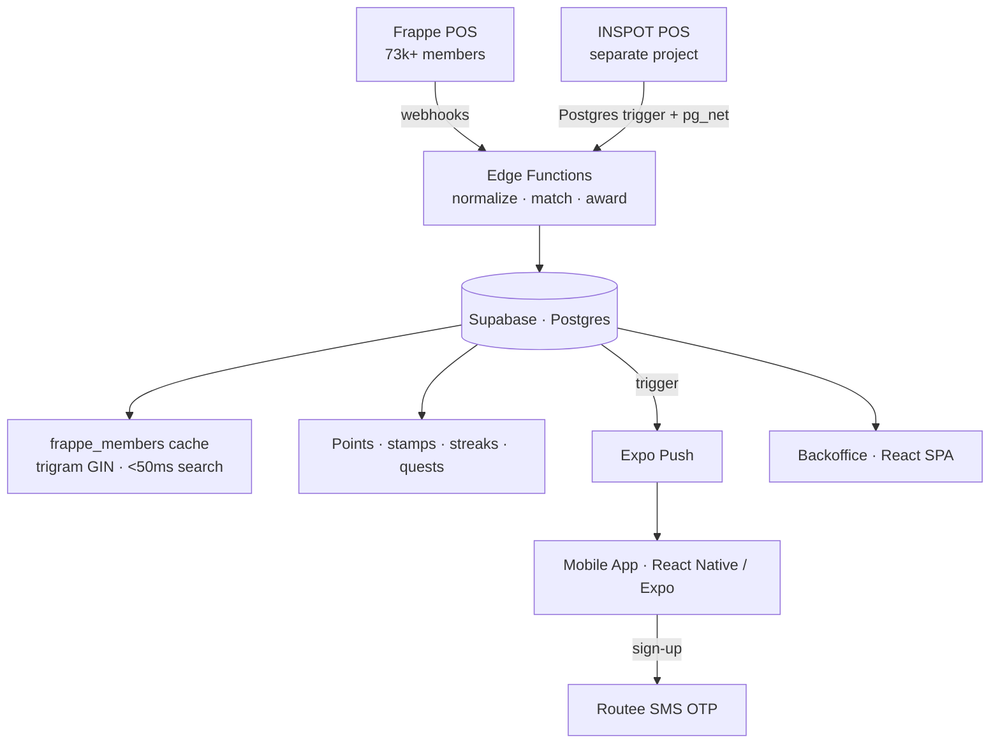

<!--
  CASE-STUDY README for NetOps Loyalty.
  -> Public repo (e.g. "netops-loyalty") = this README + /docs screenshots. Code stays private.
-->

# 🎁 NetOps Loyalty — Loyalty Platform for a Gaming-Café Network

**A unified loyalty platform for a 3-store network with 73,000+ members — a mobile app, a backoffice, and a Supabase integration layer that connects to the POS without touching its code.**

-000020?style=flat&logo=expo&logoColor=white)

> 🔒 **Source is private** to protect business IP. Documented case study — code walkthrough available on request.

---

## Screenshots

<!-- Drop images into /docs and update these paths -->
|  Backoffice |

  | Member search |  

---

## The problem

The network ran three stores with 73,000+ members registered in the POS/billing system (Frappe), but **no way to reward or reach them**:

- Member data lived only inside the POS, behind a slow, rate-limited API.
- No way to reward spend — neither gaming (hourly charges) nor bar (coffees, snacks).
- No targeted communication: no push notifications, campaigns, or per-store offers.
- A coffee bought by a customer playing at a PC was "invisible" — no way to tie the order to the member.

## The solution

**NetOps** — an ecosystem of three apps on a shared Supabase backend, with the Frappe POS as the primary source of truth for members.

- **Mobile app (React Native / Expo)** — the customer-facing loyalty app: sign-up by **SMS OTP** (Routee, "INSPOT" alpha sender) auto-linked to the member's existing POS card; real-time points (10 pts/€), stamps, visit streaks, quests and rewards; push notifications via Expo Push, fired automatically from a database trigger on every new announcement.
- **Backoffice (React SPA)** — store managers search members by name or phone in **milliseconds**; manage campaigns, coupons, quests and rewards per store or group-wide; full activity log.
- **Integration layer (Supabase Edge Functions)** — the glue, and where the hardest problems were solved.

## Architecture

## Technical challenges & solutions

**Local-first architecture for 73,000+ members.** Frappe returned members page-by-page (100/request) with rate limits, so a name search scanned hundreds of pages. Solution: full sync into a local `frappe_members` table with **trigram GIN indexes** for fuzzy search; every new member is added automatically via a per-sale webhook, so the cache never needs a full re-sync. Result: search from ~15 seconds to **<50ms**, with zero API calls.

**Reliable webhook processing.** Frappe webhooks arrived with inconsistent shapes (flat body, different field names per event type), causing duplicate point awards. Solution: a normalization layer in the edge function with correct identifier priority, unique constraints as a last line of defense, and raw-payload logging for forensics. Analyzing **697 real payloads over 48 hours** revealed exactly which fields the POS actually sent — and which were missing.

**The "coffee at the PC" problem — matching without identification.** The hardest design challenge: a customer orders a coffee from the ordering POS while playing, but the order carries no member data. Solution: a triple match cascade — (1) direct `member_id` if present, (2) phone → local-cache lookup, (3) **table + time** → an order at "PC02 at 14:35" is cross-referenced with Frappe workstation sessions ("who sat at PC02 at 14:35?") and points are credited to the right member automatically. This required collaborating with the Frappe developer to add session events (workstation, start/end, duration) to the webhooks — a request backed by real data from the payload logging.

**Zero-touch POS → loyalty link.** The custom ordering POS (a separate Supabase project) was connected with **one Postgres trigger + pg_net**: every order that turns `paid` fires an async webhook to loyalty, with zero changes to the POS code. This keeps the POS fully white-label — forks for third-party clients run untouched, with no trace of loyalty logic.

## Results

| Metric | Before | After |
|---|---|---|
| Member search | ~15s (API scan) | **<50ms** (local) |
| Frappe API calls in backoffice | Hundreds/day | **Zero** |
| Sales auto-captured | 0 | **9,000+** (and counting) |
| Visits with streak tracking | — | **6,000+** |
| Member coverage | — | **73,385 synced** |
| Bar ↔ gaming customer link | Impossible | Automatic (table+time match) |

## Key takeaways

1. **Cache first, API second.** When the source of truth is rate-limited, a local copy with automatic webhook updates changes the whole class of user experience.
2. **Data shapes the design.** The POS-matching architecture was finalized only after 48 hours of real payloads showed what the system actually sends — not what we assumed.
3. **Integration without intrusion.** Database triggers let independent systems connect while staying fully decoupled — critical when one of them is meant to be sold to third parties.

## Tech stack

**Mobile:** React Native (Expo) · Expo Push
**Web:** React SPA (backoffice)
**Backend:** Supabase — PostgreSQL (trigram GIN), Edge Functions, Realtime, pg_net triggers
**Integrations:** Frappe POS API · Routee SMS
**Hosting:** Vercel

## My role

Architect and builder across all three apps — the local-first sync and search, the webhook normalization and idempotency, the member-match cascade, the zero-touch POS integration, and the mobile + backoffice front-ends. In production across three stores.
